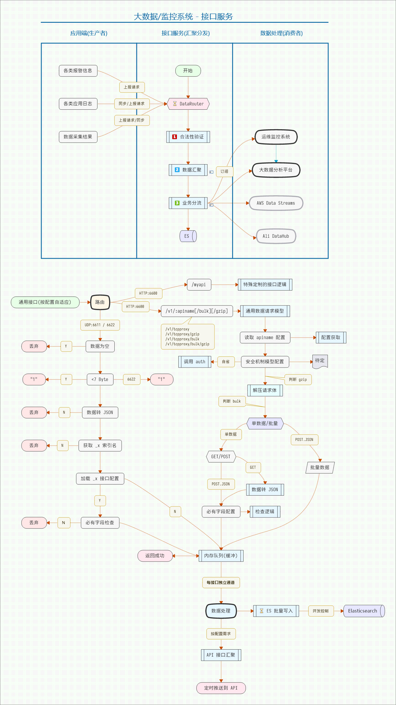

# XY.DataRouter.Standalone (通用数据分发接口 - 独立运行版本)

## 功能

- 接收各类数据上报, 化解各应用数据收集的接口压力.
- 基于配置文件自动生成接口地址, 新增接口只需要增加一行接口名称.
- 写入 ES, 可指定索引名称, 索引切割方式, 可分发数据给接口对应的应用接口.
- 可配置数据先汇聚多少秒再一并发送到应用接口, 可发送到多个应用接口, 可配置检查必有字段.
- ES 写入条数/大小/时间阈值控制, 写入并发数控制, 状态码重试配置.
- 支持 POST/GET 单条数据, POST 多条数据. POST 支持请求体压缩传输.
- 兼容旧版接口, 旧接口请求按旧接口返回格式返回结果.
- 配置文件热加载, 程序变化自动重启 (每 1 分钟检查).
- ES 通用搜索中间件, 访问 IP 白名单.
- UDP 数据上报支持.
- HTTP 接口支持数据压缩传输.
- 支持数据代理, 将接收到的数据传递给上联服务器处理.

## 分支

- 分布式版本(旧): https://github.com/fufuok/xy-data-router

- **独立运行版本**: https://github.com/fufuok/xy-data-router-standalone

## 日志

见: [CHANGELOG.md](CHANGELOG.md)

## 结构

    .
    ├── bin         程序二进制
    ├── cli         程序入口 main.go
    ├── common      公共结构定义和方法, 全局变量
    ├── conf        配置文件目录
    ├── controller  控制器, 路由
    ├── doc         开发文档
    ├── etc         配置文件
    ├── internal    内部包
    ├── log         日志目录
    ├── master      服务端程序初始化
    ├── middleware  Web 中间件
    ├── schema      数据项
    ├── script      环境变量脚本
    ├── service     应用逻辑
    ├── tools       环境变量加密小工具
    └── tunnel      数据传递通道

## 设计



## 使用

1. 先修改配置文件中的 ES 连接地址
   1. 环境变量及加密小工具见: `tools`
   2. 需要的环境变量见: `script`
2. 运行 `./bin/xydatarouter` 默认使用程序文件夹下 `./etc/xydatarouter.json`
3. 可以带配置文件路径运行 `./bin/xydatarouter -c /mydir/conf.json`
4. 可指定将 HTTP/UDP 接收到的数据传递给上联服务器处理(本地只接收请求, 不处理数据) `./bin/xydatarouter -f 1.2.3.4:6633`
5. 自动后台运行并守护自身, `Warn` 和守护日志在 `log/daemon.log`, 错误日志存放于 `log` 目录
6. 系统状态访问: http://api.domain:6600/sys/status JSON 格式, 可用于报警
7. 心跳检查地址: http://api.domain:6600/heartbeat 返回字符串 `OK`
8. PING 地址: http://api.domain:6600/ping 返回字符串 `PONG`

## HTTP/HTTPS 接口

### 1. 接口配置

#### 1.1 最简单的接口

```json
{
    "api_name": "myapi"
}
```

#### 1.2 完整的接口配置

```json
{
    "__接口名称": "接口为: http://api.domain:6600/v1/start (HTTP 接口必定回应 JSON 数据)",
    "api_name": "start",
    "__ES 索引名称": "不指定索引名前缀时, 使用 api_name",
    "es_index": "xy",
    "__ES 索引切割": "默认按天切割: api_name_201123; none: 不切割; month: 按月切割; year: 按年切割",
    "es_index_split": "",
    "__必有字段": "可为空列表或设置多个, 接口会检查上报的数据是否包含该字段",
    "required_field": [
        "type",
        "info"
    ],
    "__数据推送接口": "除数据进 ES 外, 还需要推送给第三方时设置",
    "post_api": {
        "__数据接收地址": "可多个接收 API",
        "api": [
            "http://127.0.0.1:777/api",
            "http://127.0.0.1:888/api2"
        ],
        "__推送间隔时间": "单位为秒, 汇聚多少秒的数据再推送, 0 时禁用推送",
        "interval": 0
    }
}
```

### 2. 接口地址

- `/v1/myapi` 可 GET/POST 单条 JSON 数据
- `/v1/myapi/gzip` 可 POST *gzip* 压缩后的单条 JSON 数据
- `/v1/myapi/bulk` 可 POST 多条 JSON 数据 (数据间用 `=-:-=` 分隔)
- `/v1/myapi/bulk/gzip` 可 POST *gzip* 压缩后的多条 JSON 数据

### 3. POST 请求示例

```http
POST /v1/myapi HTTP/1.1
Host: api.domain:6600
Content-Type: application/json

{  
  "xxx": "1.0.Beta",
  "yyy": 123
}
```

### 4. GET 请求示例

```http
http://api.domain:6600/v1/myapi?xxx=1.0.Beta&yyy=123
```

### 5. 批量数据请求示例

```http
POST /v1/myapi/bulk HTTP/1.1
Host: api.domain:6600
Content-Type: application/json

{  
  "xxx": "1.0.Beta",
  
  "yyy": 123
}=-:-= 
  {"xxx":"1.1","yyy":456,  "info" :   "test"}
```

### 6. 应答

```json
{
    "id": 1,
    "ok": 1,
    "code": 0,
    "msg": "",
    "data": null,
    "count": 0
}
```

`ok` 或 `id` 为 1 表示成功, 0 表示失败, `code` 相反, 0 表示成功, 1 表示失败

### 7. 压缩传输示例

```python
import requests
import time
import gzip
import json

api_url = 'http://api.domain:6600'
api_name = '/v1/myapi/bulk/gzip'
# 原始数据
data = {
    'code': 'test',
    'timestamp': time.time()
}
# 批量 JSON 数据, 用 =-:-= 分隔多个 JSON 字符串
js = (json.dumps(data) + '=-:-=') * 100
# 压缩 JSON 数据
gz = gzip.compress(js.encode('utf-8'))
# 压缩情况: 5400 => 106
print(len(js), '=>', len(gz))
# POST 请求
res = requests.post(api_url + api_name, gz)
print(res.json())
```

注: 压缩传输仅支持 POST 方法, 很小的数据量不建议使用压缩传输.

## UDP 接口

### 1. 接口配置

UDP 接口默认不用配置, 直接可用. 

- `6611` 无应答接口, 即仅收 UDP 数据, 不回包 (探针包除外)
- `6622` 带应答接口, 每收到 UDP 数据都回包: `1`

### 2. 探针

可选使用

用于测试接口服务是否正常, 发送请求数据为 `1-6` 字节即可, 回包内容固定为字符 `1`

#### 请求数据示例

```python
import json
import socket

# 无应答接口
dst_6611 = ("api.domain", 6611)
# 有应答接口
dst_6622 = ("api.domain", 6622)

# 连
s = socket.socket(socket.AF_INET, socket.SOCK_DGRAM)

# 探针请求, 发送 1-6 个字节的数据, 两个接口均可使用
s.sendto(b"f", dst_6611)
# 收: 收到应答字符: 1
res = s.recv(1).decode()
print(res)

if res == "1":
    # 发正式数据, 带应答的接口
    s.sendto(json.dumps({
        "_x": "sendto_demo",
        "xxxx": "myData1"
        }).encode(), dst_6622)
    # 收
    print(s.recv(1024).decode())

    # 发正式数据, 无应答的接口
    s.sendto(json.dumps({
        "_x": "ff",
        "xxxx": "myData2"
        }).encode(), dst_6611)

# 关
s.close()
```

### 3. 数据上报

#### 3.1 数据格式

`JSON`

#### 3.2 字段要求

JSON 数据中必须有 `_x` 字段, 且不能为空, 不能包含 `:` 冒号.

该字段表示要写入哪个 ES 索引.

**若 UDP 数据中 `_x` 字段值与配置中接口名相同, 则会共用该配置中的字段校验和数据分发规则.**

#### 3.3 请求数据示例

```json
{  
  "_x": "udp_app1",
  "server_ip": "123.4.5.6",
  "command": "rm -rf /tmp/test",
  "info": "test",
  "other": "除 _x 必须外, 这里的字段可任意扩展"
}
```

***注意: 内容必须是正常 JSON 字符串, 注意转义文本中的双引号***

#### 3.4 应答

应答规则如下:

- 探针请求均应答字符: `1`
- `6611` 端口不应答, 即服务端不会给客户端回包
- `6622` 端口会应答, 接口收到请求数据时, 固定回包数据为字符: `1`
- 丢弃规则:
  - 未收到数据, 网络丢包
  - 数据不是合法 JSON 键值对字符串
  - 数据中未包含 `_x` 字段, 或该字段值不符合要求
  - 接口配置中有限定必有字段, 但数据中未包含该字段

## 限制

`=-:-=` 为数据分隔符, 请不要出现在上报内容中!!!


*ff*